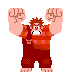
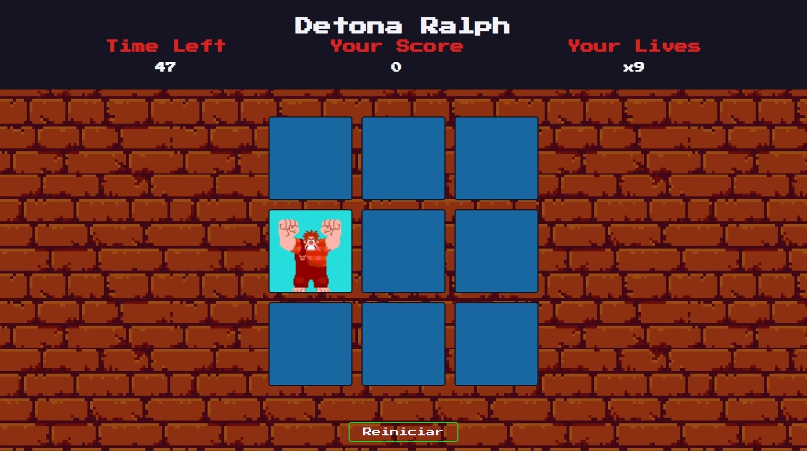
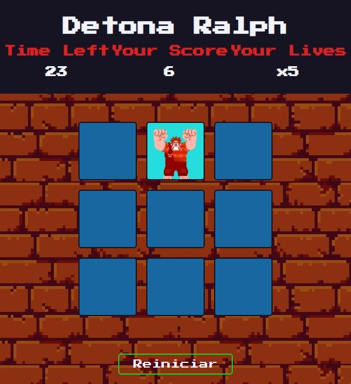
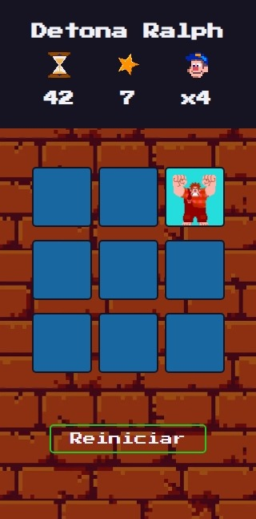

# Criando um Jogo do Detona Ralph com JavaScript


Projeto inspirado no **Detona Ralph**, desenvolvido usando **JavaScript**, **HTML** e **CSS**. O objetivo é acertar o Ralph enquanto ele aparece aleatoriamente nos quadrados, ganhando pontos por cada acerto. O jogador tem um tempo limite e um número definido de vidas.



## Tecnologias 🛠️

- **HTML5**: Estruturação da interface do jogo.
- **CSS3**: Estilização visual e layout responsivo.
- **JavaScript (ES6+)**: Lógica do jogo, manipulação do DOM, e interatividade.

## Funcionalidades 🕹️

- **Contagem regressiva:** O jogador tem 60 segundos para jogar.
- **Pontuação:** Cada acerto aumenta a pontuação do jogador.
- **Sistema de vidas:** O jogador começa com 9 vidas, e perde uma vida por cada clique incorreto.
- **Reset do jogo:** Ao clicar no botão "Reiniciar", o jogo é recomeçado com os valores padrão.

### Responsividade 💻

Foi adicionada responsividade ao projeto, utilizando media queries para ajustar a interface para diferentes tamanhos de tela (`max-width: 768px` e `max-width: 480px`).







## Como rodar o projeto ❇️

1. Clonar o repositório:

    ```bash
    git clone https://github.com/Err0rGCeni/DIOProject_DetonaRalph.git
    ```

2. Navegar ao diretório do projeto:

    ```bash
    cd DIOProject_DetonaRalph
    ```

3. Abrir o arquivo `index.html` no navegador.
